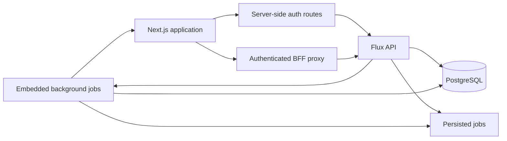

# Flux

Flux is a web-based retail and production management platform created for businesses
that sell physical products, services, and customized orders in the same operation.
It centralizes point of sale, inventory, service orders, cash control, customers,
history, and decision support in one interface.

The current release is focused on the D'lara pilot. The product and backend are
tenant-aware, but commercial tenant onboarding remains a future delivery.

## Product overview

Flux connects daily operations with persisted business history and deterministic
analytics:

- complete sales from a point-of-sale workspace;
- track products, services, stock balances, minimum stock, prices, and costs;
- organize production and customization work on a service-order board;
- open, supply, withdraw from, reconcile, and close assigned cash registers;
- manage customers, employees, categories, and measurement units;
- review sales history and export records;
- monitor management KPIs, forecasts, replenishment suggestions, and promotion
  candidates;
- display evidence-bound AI explanations without allowing AI to modify operational
  data.

No production business flow depends on local fixtures or browser-persisted business
data. Flux API is the source of truth.

## Application areas

| Area | Purpose | Access |
| --- | --- | --- |
| Dashboard | Revenue, sales, inventory, and operational overview | Administrator |
| Point of Sale | Cart, customer, discount, payment, change, and sale completion | Administrator and employee |
| Service Orders | Kanban workflow for production and customized services | Administrator and employee |
| Cash | Assigned register operations and reconciliation | Administrator and employee |
| Cash History | Closed cash-session review | Administrator |
| Intelligence | Forecasts, recommendations, confidence, evidence, and AI explanations | Administrator |
| Inventory | Products, services, stock, prices, costs, categories, and units | Administrator and employee |
| Sales History | Persisted sale records and CSV export | Administrator and employee |
| History KPIs | Revenue and historical aggregate indicators | Administrator |
| Customers | Customer registration and maintenance | Administrator and employee |
| Employees | User, role, status, and password administration | Administrator |
| Settings | Catalog settings and local presentation preferences | Authenticated user |

Employees start at Point of Sale. Administrators start at Dashboard. Interface
visibility improves usability, while Flux API remains the authorization boundary.

## Runtime architecture



The browser calls only local Next.js routes:

1. Authentication routes exchange credentials and refresh tokens with Flux API.
2. Access and refresh tokens remain in HTTP-only, SameSite-strict cookies.
3. `proxy.ts` protects pages, validates JWT issuer, audience, and algorithm, and renews
   expired access tokens.
4. `/api/backend/[...path]` forwards authenticated business requests to `/api/v1`.
5. The BFF forwards request IDs and idempotency keys and retries once after a successful
   token refresh.

The browser never chooses a tenant or sends a role as authorization evidence.

## Technology

| Layer | Technology |
| --- | --- |
| Framework | Next.js 16 App Router |
| UI runtime | React 19 |
| Language | TypeScript 5 |
| Styling | Tailwind CSS 4 |
| UI primitives | shadcn/ui, Base UI, and Radix Slot |
| Client state | Zustand 5 |
| Forms and validation | React Hook Form and Zod |
| HTTP | ky through the local BFF |
| Authentication | jose |
| Drag and drop | dnd-kit |
| Icons and notifications | Lucide and Sonner |

## Getting started

### Requirements

- Node.js 22 or newer
- npm
- A running [Flux API](../Flux-API/README.md)

### Installation

```bash
npm ci
cp .env.example .env.local
npm run dev
```

Open [http://localhost:3000](http://localhost:3000).

The backend must be reachable through `API_URL`. For a complete local environment,
start and migrate Flux API before opening the frontend.

### Environment variables

| Variable | Required | Description | Default |
| --- | --- | --- | --- |
| `API_URL` | Yes in production | Server-side Flux API base URL | `http://localhost:3333` |
| `JWT_SECRET` | Yes | Access-token verification secret; must equal Flux API `JWT_ACCESS_SECRET` | None |
| `JWT_COOKIE_NAME` | No | Access-token cookie name | `flux_token` |
| `REFRESH_COOKIE_NAME` | No | Refresh-token cookie name | `flux_refresh_token` |
| `REFRESH_COOKIE_MAX_AGE` | No | Refresh-cookie maximum age in seconds | `2592000` |
| `NODE_ENV` | No | Next.js runtime environment | `development` |

Do not expose `JWT_SECRET` through a `NEXT_PUBLIC_` variable.

## Commands

| Command | Purpose |
| --- | --- |
| `npm run dev` | Start the development server with Webpack |
| `npm run build` | Create an optimized production build |
| `npm start` | Run the production build |
| `npm run typecheck` | Validate TypeScript without emitting files |
| `npm run lint` | Run ESLint |

The repository configures a pre-push hook that runs typecheck, lint, and build.
The same checks run in CI with `npm ci`.

## Project structure

```text
src/
├── app/
│   ├── (auth)/login/          Public login page
│   ├── (app)/                 Authenticated product screens
│   │   ├── dashboard/
│   │   ├── frente-de-caixa/
│   │   ├── ordens/
│   │   ├── caixa/
│   │   ├── inteligencia/
│   │   ├── inventario/
│   │   ├── historico/
│   │   ├── clientes/
│   │   ├── funcionarios/
│   │   └── configuracoes/
│   └── api/
│       ├── auth/              Login, current-user, and logout routes
│       └── backend/           Authenticated Flux API proxy
├── components/
│   ├── analytics/             Forecast and analytical visualizations
│   ├── caixa/                 Cash dialogs, totals, and reconciliation
│   ├── layout/                Header, sidebar, and application shell
│   ├── shared/                Reusable product-level components
│   └── ui/                    UI primitives
├── lib/                       API, auth, access control, search, and formatters
├── store/                     API-backed state and local UI preferences
├── types/                     Frontend contracts
├── proxy.ts                   Page authorization and token renewal
└── app/globals.css            Design tokens and global styles
```

## State and data ownership

- Zustand stores coordinate API-backed state shared across screens.
- Theme, font size, and sidebar collapse are the only browser-persisted preferences.
- Money, stock, cash totals, permissions, KPIs, forecasts, and recommendations are
  calculated or validated by Flux API.
- State-changing requests use idempotency keys where supported by the backend.
- Product quantity inputs respect the decimal scale configured for each unit.

## Quality and security

Before opening a pull request:

```bash
npm run typecheck
npm run lint
npm run build
npm audit --omit=dev
```

Security-sensitive behavior includes HTTP-only cookies, strict token verification,
server-side role enforcement, refresh-token rotation, request correlation IDs, and
idempotent mutations.

## Current limitations

- Administrator sales history and global search currently index the latest 100 sales.
- Automated browser and component tests are not yet available.
- Full commercial tenant onboarding is not part of the D'lara pilot.

See the backend
[implementation status](../Flux-API/docs/implementation-status.md) for the complete,
verified delivery status and planned gaps.

## Documentation

- [Frontend architecture](./ARCHITECTURE.md)
- [Backend overview](../Flux-API/README.md)
- [Backend architecture and business rules](../Flux-API/ARCHITECTURE.md)
- [Implementation status](../Flux-API/docs/implementation-status.md)
